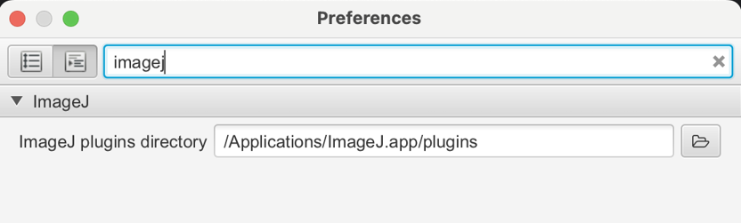
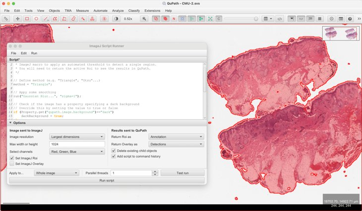

## QuPath for Fiji Fans

Considering [QuPath](http://qupath.github.io), but wishing you could just use [Fiji](https://fiji.sc)? 🤔

Then the *QuPath for Fiji Fans* [I2K 2024](https://www.i2kconference.org) workshop is for you. 

In this repo you'll find scripts & docs that show how you can use your ImageJ and Fiji skills with QuPath, 
to get the best of both.

> [!IMPORTANT]
> The main docs for QuPath & Fiji/ImageJ are [here](https://qupath.readthedocs.io/en/latest/docs/advanced/imagej.html) 
> _but they haven't been updated to have all the new stuff described in the workshop yet_.

## Accessing ImageJ plugins
QuPath comes with its own minimal ImageJ (`ij.jar`).

If you want to be able to access more plugins, you'll need to point QuPath to a local ImageJ or Fiji installation.

There are two (equivalent) ways to do this:

1. _Extensions → ImageJ → Set local ImageJ directory_
    * This gives a directory chooser, and makes an educated guess where ImageJ or Fiji might be installed. 
2. _Edit → Preferences..._
    * This allows you to type the path to the directory

> [!TIP]
> You can also set the plugins directory to a [Fiji](https://fiji.sc) installation.
> Not *all* Fiji plugins are guaranteed to work when run within QuPath, but many do.

## Sending regions to ImageJ & back
You can interactively send regions from QuPath to ImageJ, and also bring ImageJ Rois back as QuPath objects.

Regions can be cropped and rescaled, and QuPath should take care of transforming all the regions appropriately.

The docs [here](https://qupath.readthedocs.io/en/latest/docs/advanced/imagej.html#sending-image-regions-to-imagej) 
describe this in more detail.

## ImageJ Script Runner
QuPath v0.6.0-rc3 introduces an all-new command: _Extensions → ImageJ → ImageJ script runner_

This is intended to replace _Extensions → ImageJ → ImageJ macro runner_.

The purpose of this command is to make it easier to send cropped and rescaled regions to ImageJ for processing in batch, 
and then get the results back into QuPath.

But you can also do more things, like set classifications or add measurements to QuPath objects.

The workshop videos will show this in more detail, or check out _File → Open example..._.

> [!NOTE]
> The ImageJ script runner provides an easy way to apply any of ImageJ's automatic thresholding methods 
> within QuPath.

> [!TIP]
> The new script runner supports both the ImageJ macro language and Groovy scripts.
> Currently, it attempts to guess which you're writing based on whether `IJ.getImage()` is present.

> [!CAUTION]
> The parameters at the bottom of the script runner are important!
> These determine what is sent to ImageJ, and what is brought back to QuPath.

> [!TIP]
> If you have a script that is working well, turn on the _Add script to command history_ option if you want to be able 
> to [apply it in batch across multiple images]().
